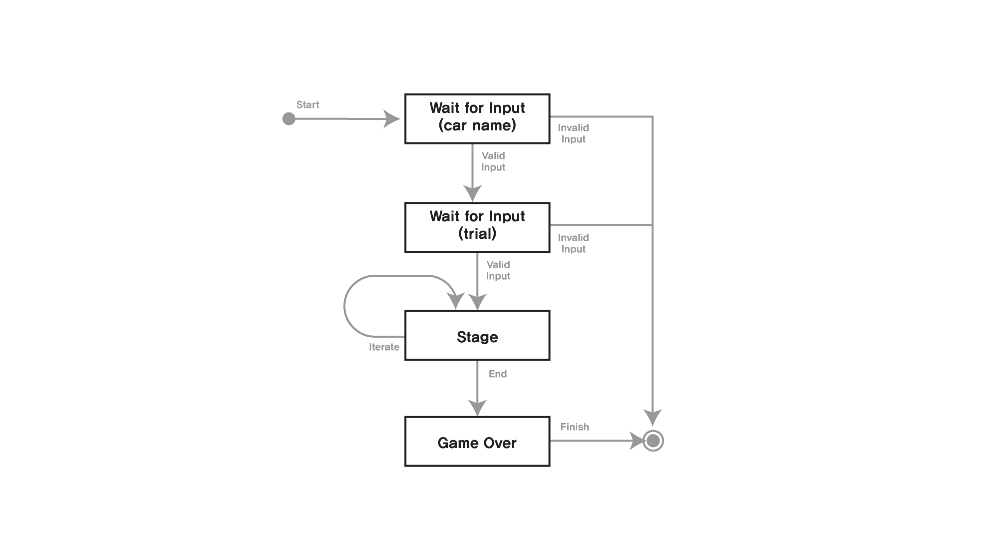

## 기능목록

- [X] 게임을 시작한다
- [X] 입력을 받는다
  - [X] 자동차 이름을 받기 전에 "경주할 자동차 이름을 입력하세요.(이름은 쉼표(,) 기준으로 구분)"를 출력한다.
  - [X] 자동차 이름을 입력 받는다
  - [X] 시도할 횟수를 입력하기 전에 "시도할 회수는 몇회인가요?"를 출력한다.
  - [X] 시도할 횟수를 입력 받는다 
- [X] 입력이 유효한지 검증한다
  - [X] 자동차 이름이 빈 공백이면 IllegalArgumentException을 발생시키고 종료한다
  - [X] 자동차 이름이 6자 이상이면 IllegalArgumentException을 발생시키고 종료한다
  - [X] 시도할 횟수가 0 이하의 값이라면 IllegalArgumentException을 발생시키고 종료한다 
  - [X] 기타 입력이 유효하지 않는 경우에 IllegalArgumentException을 발생시키고 종료한다
- [X] 게임을 진행한다
  - [X] 게임을 진행하기 전 "실행 결과"를 출력한다
  - [X] 중간 결과를 계산하기
  - [X] 중간 결과를 출력한다
      - [X] 각 자동차별 실행 결과를 출력하기
- [X] 결과를 출력한다
  - [X] 최종우승자를 산정한다
  - [X] 최종우승자를 출력한다
  

## 설계

### 초기 도메인 모델

* Game Executor  : 게임을 실행
* Racing Car Game : 레이싱 카 게임의 로직을 수행 
* Racing car : 레이싱 카의 로직을 수행
* Game Output View : 게임의 아웃풋 뷰
* Game Input View : 게임의 인풋 뷰 

## 초기 도메인 상태 모델

1. 상태
   * Wait For Input(car name) : 레이싱 카의 이름들을 입력으로 받는다
   * Wait For Input(trial) : 시도할 횟수를 입력으로 받는다
   * Stage : 각 게임의 찻수를 실행한다
   * Game Over : 최종 결과를 출력한다

2. 트리거
   * Invalid Input : 유효하지 않은 입력을 받는다
   * Valid Input : 유효한 입력을 받는다
   * Iterate : 찻수를 반복한다
   * End : 게임을 종료한다

## 결과물

### 각 함수의 기능목록
| 클래스             | 접근자 | 함수 | 책임                                                                                       |
|-----------------| --- | --- |------------------------------------------------------------------------------------------|
 | GameExecutor    | public | run | Game의 초기화에 필요한 입력을 받는다  Game을 생성시킨다 Game.run()을 호출한다                                 |
 | RacingCarGame   | public | run | runStage()를 trial횟수 만큼 호출한다 최종 횟수를 출력한다                                                  |
 | RacingCarGame   | public | toString | 각 자동차들의 toString()을 출력한다                                                                 |
 | RacingCarGame   | private | getWinners | 자동차들 중에서 가장 높은 Position을 갖는 값(p)을 찾는다  자동차들 중에서  p와 같은 Poisiton을 갖는 자동차의 이름들을 출력한다   |
 | RacingCarGame   | private | createCars | 자동차의 이름들을 받아서 자동차 객체의 목록으로 변환한다   이때 이름이 중복되는 자동차가 있으면 IllegarArgumentException을 반환한다 |
 | RacingCarGame   | private | runStage | 각 자동차Random.randomNumberRange() 값을 이용하여서  각 Racingcar.tryForward()를 호출한다                                                |
 | RacingCarGame   | private | checkTrial | trial 횟수가 1 이상의 값이 아니라면 IllegalArgumentException을 발생시킨다                                  |
 | GameRandom      | public | randomNumberRange | start 이상 end 미만의 값중에서 Random하게 출력시킨다                                                     |
 | RacingCar       | public | tryForward | number값을 받아서 number값이 4이상이면 전진시킨다                                                        |
 | RacingCar       | public | isSamePositionWith | 입력받은 다른 RacinCar와 같은 Position인지 출력한다                                                     |
 | RacingCar       | public | getName | 자신의 이름을 출력한다                                                                             |
 | RacingCar       | public | toString | 자신의 이름과 포지션을 출력한다                                                                        |
 | InputInterface  | public | getNames | 유저한테서 name들을 Input 받는다                                                                   |
 | InputInterface  | public | getTrial | 유저한테서 시도 횟수들을 Input 받는다                                                                  |
 | OutputInterface | public | println | 입력받은 문자열을 출력한다                                                                           |
 | OutputInterface | public | printStage | 입력받은 Game의 toString()을 출력한다                                                              |
 | OutputInterface | public | printWinner | 입력받은 winner목록을 출력한다                                                                      |

